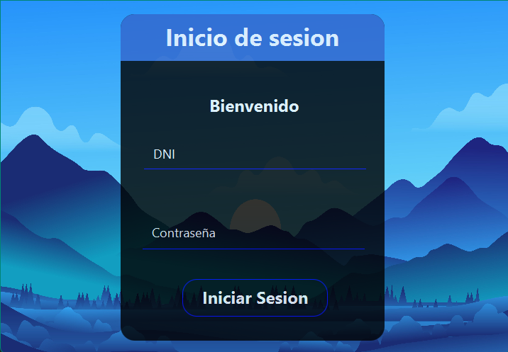
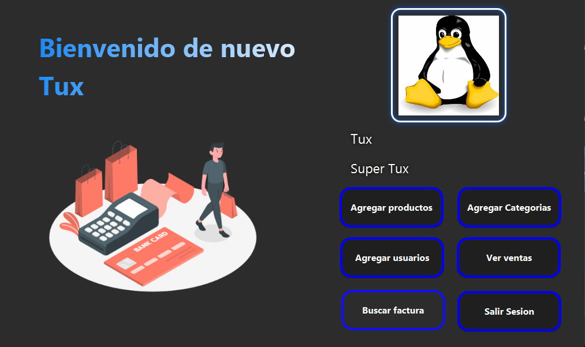
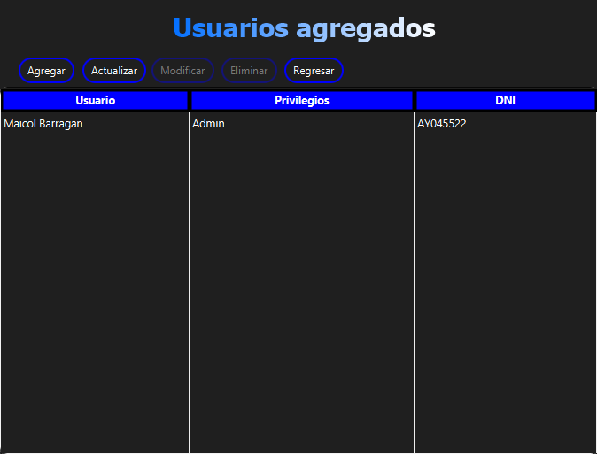
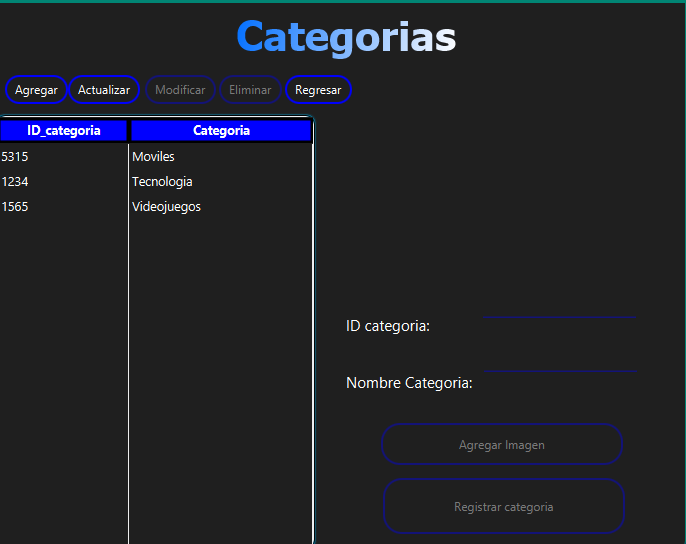
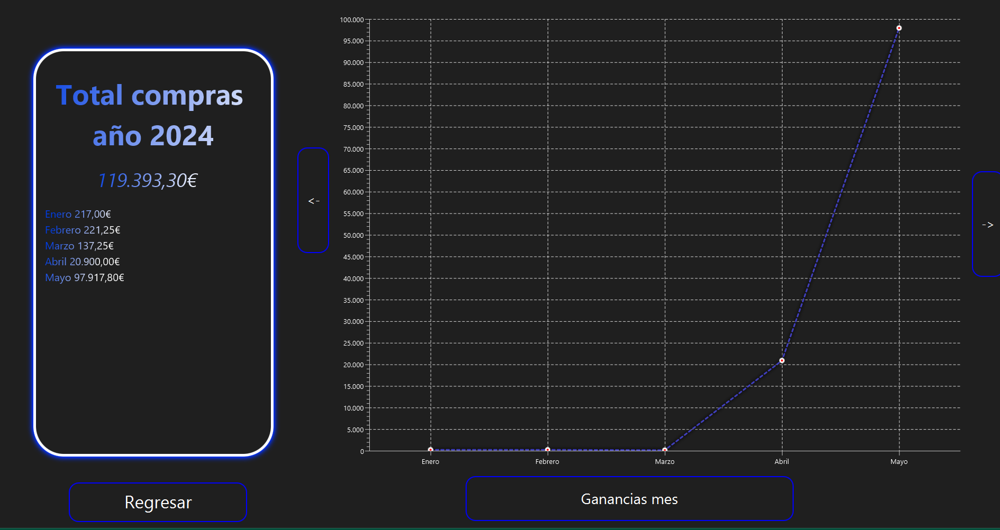
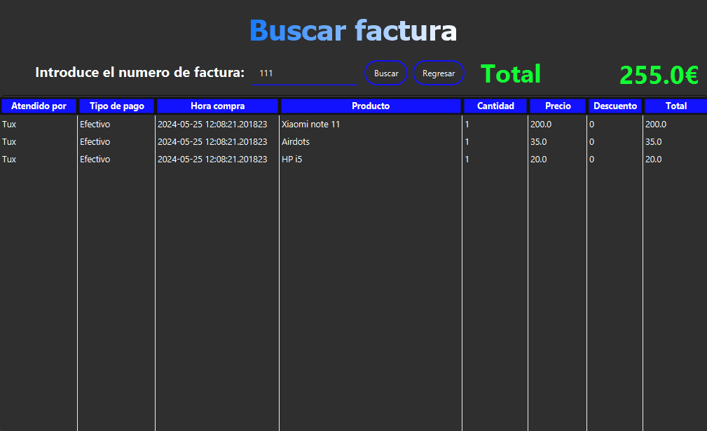

# Ejercicio TPV - Parte 1
## Introducción
En esta parte se hará la administración del tpv, primero tenemos que iniciar sesión y cuando accedemos según nuestros privilegios podremos crear los usuarios, categorías y los productos. También podremos ver las ventas y un historial de facturas.
## Escena inicio sesión
La primer escena al arrancar el proyecto es un inicio de sesión, existe un usuario que es Super Administrador que viene por defecto en la aplicación, se accede por el DNI y por la contraseña.

## Escena principal
En esta escena tendremos multiples opciones para cambiar a las diferentes escenas o salir de sesión y veremos nuestro usuario con nuestros privilegios.

## Escena usuarios
En esta escena tendremos 5 botones, el botón `Agregar` nos saldra una ventana con un formulario donde rellenaremos nuestros datos, el botón `Actualizar` actualizaremos el contenido de la tabla, el botón `Modificar` cuando seleccionamos un registro en la tabla y le damos a modificar podremos hacer cambios en nuestro usuario, y el botón `Eliminar` para borrar el usuario.    

## Escena productos
En esta escena podremos agregar los productos que tengamos con el botón `Agregar`, `Actualizar` para actualizar la tabla, `Modificar` si seleccionamos un registro, `Eliminar` para borrar un registro y para regresar a la escena anterior.

## Escena categorías
En esta escena tendremos una lista donde podemos agregar categorías, podremos modificar las categorías y eliminarlas.

## Escena ventas
En esta escena podremos ver las compras del año y del mes, donde tendremos las compras del año con el total de cada mes y otra escena con el total de compras de cada dia.

## Escena buscar factura
En esta escena podremos buscar facturas a traves del id de factura dado al cliente, donde podremos ver lo que compro y  a que hora.

