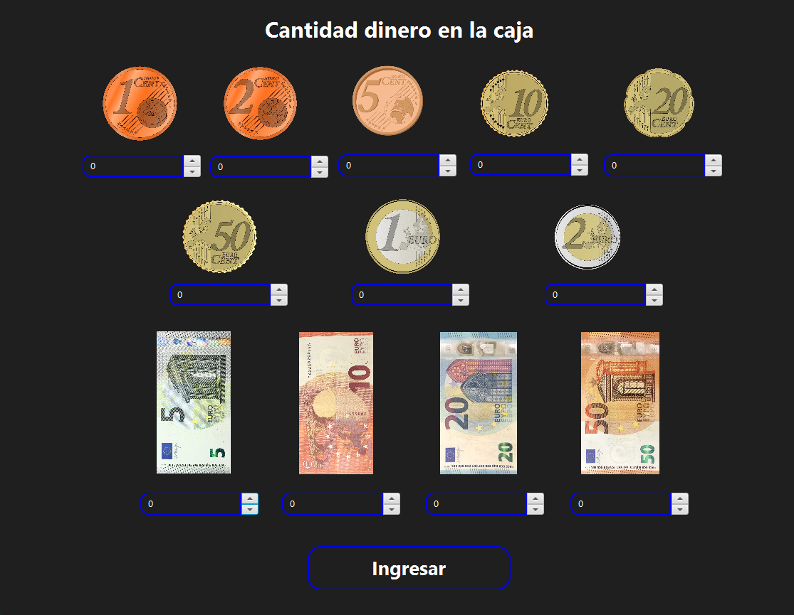

# Ejercicio TPV - Parte 2
## Introducción
En esta parte se hará  el trabajador va poder registrar las compras de los clientes, iniciara con un inicio de sesión, dirá cuanto dinero tiene en la caja, el trabajador registrara todas las compraras y cuando termine y cerrara la caja, cuenta cuanto dinero tiene en la caja
## Escena inicio sesión
La primer escena al arrancar el proyecto es un inicio de sesión, existe un usuario que es Super Administrador que viene por defecto en la aplicación, se accede por el DNI y por la contraseña.

## Escena dinero en caja.
En esta escena tendremos que ingresar cuanto dinero tendremos en la caja y luego ingresar para ir a la escena principal.

## Escena principal
En esta escena tendremos la pantalla principal del tpv, tendremos datos como el cajero que esta usando el tpv y la lista de productos que tenemos registrados con el otro programa.

Esta escena esta hecha para que se use en pantalla táctiles, tiene el teclado para buscar los productos, tenemos un campo para cuando pasemos la pistola escáner se rellene y lo busque, en la tabla del lado derecho cuando tengamos el producto presionamos dos veces y se agregara a la tabla izquierda calculando el descuento si tiene , si seleccionamos de nuevo el mismo se disminuirá la cantidad o se quitara de la lista, cuando ya tengamos registrados todos los productos podemos cobrar con tarjeta o efectivo, si cobramos con efectivo tendremos que ingresar obligatoriamente cuanto dinero nos da el cliente y nos dirá el cambio y con tarjeta no sera obligatorio, imprimirá la factura.

Por seguridad si la aplicación se cierra accidentalmente, guardara los datos de cuanto dinero hay en la caja y cuando iniciamos de nuevo no necesitamos volver a iniciar sesión y se abrirá automáticamente la escena principal, cuando terminamos vamos a cerrar la caja y de nuevo vamos a ingresar el dinero que tenemos en la caja, sera la misma escena de cuando ingresamos.

Cuanto ingresamos el dinero que tenemos en la caja nos mostrara si hubo un descuadre de dinero en la caja y de cuanto en total.

